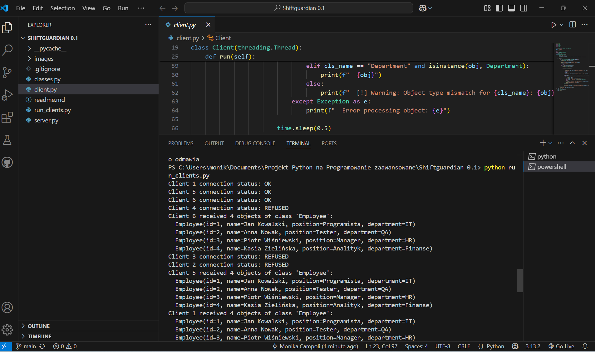
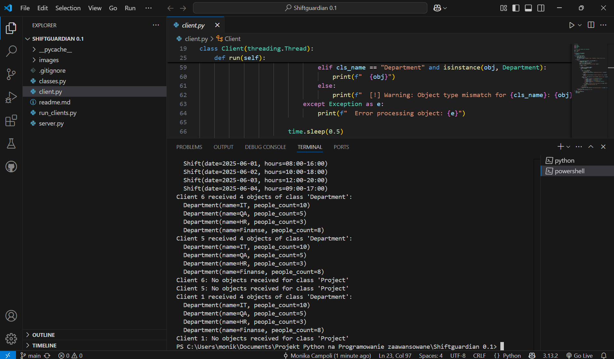

# Projekt SHIFTGUARDIAN w modelu Klient-Serwer — Aplikacja z Obsługą Wielu Klientów

## Opis projektu

Projekt realizuje aplikację w modelu klient-serwer, w której serwer przechowuje obiekty trzech klas (Employee, Shift i Department.), a klienci mogą żądać kolekcji obiektów konkretnej klasy. Serwer obsługuje wielu klientów jednocześnie, ograniczając ich liczbę do stałej MAX_CLIENTS. Nadmiarowi klienci otrzymują odpowiedź REFUSED.

Klienci wysyłają swoje ID oraz nazwę klasy, której obiekty chcą otrzymać. Serwer zwraca zserializowaną kolekcję obiektów. Klient deserializuje dane i wypisuje je na konsolę. Jeśli żądana klasa nie istnieje, klient obsługuje błąd rzutowania.

Projekt zrealizowany w ramach zaliczenia przedmiotu **Programowanie zaawansowane**.

---

## Wymagania projektowe

Projekt demonstruje:

- Definicja co najmniej trzech klas, każda z minimum dwoma polami oraz metodami (`__init__`, `__str__`, `__eq__`).
- Serwer przy starcie tworzy po 4 obiekty każdej klasy, przechowuje je w mapie (słowniku) z kluczami w formacie: `nazwaKlasy_nr` (np. `employee_1`).
- Obsługa wielu klientów jednocześnie (wielowątkowo).
- Ograniczenie liczby jednoczesnych klientów przez stałą `MAX_CLIENTS`.
- Klient przesyła swoje ID (liczba), serwer odpowiada `OK` lub `REFUSED`.
- W przypadku odmowy klient kończy działanie.
- W przypadku akceptacji klient wysyła żądania pobrania kolekcji obiektów konkretnej klasy.
- Serwer wysyła zserializowaną kolekcję obiektów lub pojedynczy losowy obiekt, jeśli kolekcja nie istnieje.
- Klient odbiera dane, wypisuje na konsoli obiekty wraz ze swoim ID.
- Obsługa błędów rzutowania i deserializacji na kliencie.
- Losowe opóźnienia w obsłudze klienta po stronie serwera.
- Wspólna synchronizacja dostępu do listy połączonych klientów (blokady).
- Skrypt `run_clients.py` do uruchamiania wielu klientów z różnym opóźnieniem startu.
- Plik `.gitignore` ignoruje pliki `*.pyc` oraz foldery `__pycache__/`.

---

## Struktura projektu
- Widok plików
    ```bash
    ├── classes.py          # Definicje klas: Employee, Shift i Department.
    ├── server.py           # Implementacja serwera (wielowątkowego)
    ├── client.py           # Implementacja klienta (wielowątkowego)
    ├── run_clients.py      # Skrypt uruchamiający wielu klientów równocześnie
    ├── README.md           # Ten plik
    ├── .gitignore          # Ignorowanie plików tymczasowych
    └── images/             # Folder z zrzutami ekranu działania aplikacji
        ├── ex1.png         # Widok działania serwera
        ├── ex2.png         # Widok działania klienta
        ├── ex3.png         # Widok działania wielu klientów (część 1)
        └── ex4.png         # Widok działania wielu klientów (część 2)

---

## Instrukcja uruchomienia

1. Uruchom serwer (w terminalu):
   ```bash
   python server.py

2. Uruchomienie pojedynczego klienta (w innym terminalu):
    ```bash
    python client.py

3. Uruchomienie wielu klientów naraz za pomocą skryptu run_clients.py:
    ```bash
    python run_clients.py

---

## Przykładowy zrzut ekranu działania

    Widok działania servera


    Widok działania klienta


    Widok działania kilku klientów



    Widok działania kilku klientów c.d.



### Technologie i narzędzia

+ Python 3.x
+ Moduły: socket, threading, pickle, time, random
+ Serializacja obiektów przez pickle
+ Wielowątkowość (wątki dla obsługi wielu klientów)
+ Synchronizacja dostępu do zasobów (threading.Lock)

## Działanie aplikacji

- Serwer uruchamia się, tworzy po 4 obiekty klas Employee, Shift i Department., i przechowuje je w mapie.

- Klient łączy się z serwerem, wysyła swoje ID.

- Serwer sprawdza limit MAX_CLIENTS. Jeśli limit przekroczony — odrzuca klienta (REFUSED).

- Jeśli klient zaakceptowany (OK), wysyła żądanie kolejno o kolekcje różnych klas.

- Serwer odsyła zserializowaną listę obiektów danej klasy.

- Klient deserializuje i wypisuje obiekty. Jeśli klasa nie istnieje, obsługuje wyjątek.

- Po obsłużeniu 5 żądań, klient kończy działanie, a serwer zwalnia zasoby.

## Możliwe rozszerzenia i ulepszenia

- Logowanie zdarzeń do plików (logi serwera i klientów)
- Konfiguracja parametrów (port, MAX_CLIENTS, klasy) z pliku .json lub .yaml
- Rozszerzona obsługa błędów i przypadków brzegowych
- Wprowadzenie GUI dla klienta
- Wykorzystanie bezpieczniejszych formatów serializacji (np. JSON)
- Testy jednostkowe i integracyjne
- Mechanizmy bezpieczeństwa (autoryzacja, szyfrowanie komunikacji)
- Rozbudowa aplikacji o operacje CRUD na obiektach
- Dokumentacja UML pokazująca architekturę aplikacji

### Autor
Monika Campoli

Projekt zaliczeniowy z przedmiotu **Programowanie zaawansowane**, maj 2025

[def]: images/ex1.png